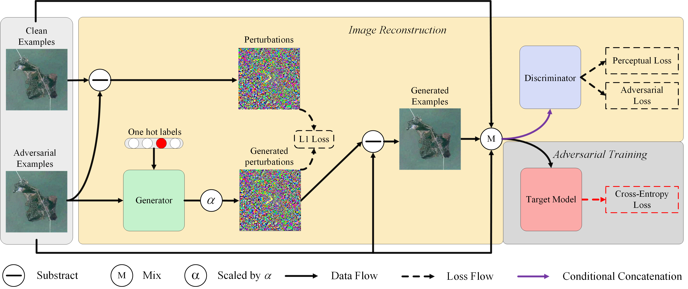

# PSGAN ：Perturbation Seeking Generative Adversarial Networks: A Defense Framework for Remote Sensing Image Scene Classification

**Official** source code of the paper:

G. Cheng, X. Sun, K. Li, L. Guo, and J. Han, "Perturbation Seeking Generative Adversarial Networks: A Defense Framework for Remote Sensing Image Scene Classification", *IEEE Trans. Geosci. Remote Sens.*



## System Environment

* CUDA: CUDA 9.0
* CUDNN: CUDNN 7.6.5
* Ubuntu: Ubuntu 16.04.7
* gcc/g++: 5.4.0

## Getting Started

### 1. Clone this repository

```
git clone https://github.com/xuxiangsun/PSGAN.git
cd PSGAN
```
### 2. Python Environment

To install the python environment, please run:

```
conda env create -f ./condalist.yml
```

Tips:  If you can not install the whole packages in condalist.yml, you can check which package can not be download and shield it firstly. Then, running

```
conda env create -f ./condalist.yml
```

to install other packages.
Next, you can download and install these shielded packages manually.

### 3. Datasets Preparation

The datasets are all saved in `/path of PSGAN/datasets`, so we should make a new directory firstly:

```
mkdir ./datasets
```

In our experiments, we use three benchmarks includes [the UC Merced Land-Use Dataset](http://weegee.vision.ucmerced.edu/datasets/landuse.html), [the AID Dataset](https://captain-whu.github.io/AID/), and [the NWPU-RESISC45 Dataset](https://gcheng-nwpu.github.io/datasets). After downloading these datasets, please unfold them to the right directory.  `It is noticeable that for any dataset, we should organize the directory tree of the dataset folder into the following structure`:

```
.
├── class name1
├── class name2
├── ...
└── class namek
```

#### Customize your own dataset

Besides the dataset folder's organization we mentioned above, there are some extra settings should be done.

1. Firstly, we also should write the classes dictionary file : <dataset name>_dict.txt (e.g., NWPURESISC45_dict.txt) to save the mapping from the class name to class ID. You can generate this file by running (taking the NWPU-RESISC45 Dataset as an example):

   ```
   python read_classes.py --dataroot ./datasets/NWPURESISC45
   ```

2. Secondly, we also should customize the dataset file in ./data folder for our own dataset. Pay attention that the dataset's name in <dataset name>_dict.txt, the name of the dataset folder in ./datasets, and the name of the dataset file in ./data should be the same.

### 4. Training Target Models

It is noticeable that the pre-trained models on ImageNet are leveraged by our code when we train the target model. Thus, we should download the pre-trained models on ImageNet to `./pretrained` directory.  Firstly, we should make a new directory by running the following command:

```
mkdir ./pretrained
```

And then, downloading the pre-trained models needed by your own experiment and saving them at `./pretrained`.

To train a target model, please run:

```
python train_target_model.py --dataroot ./datasets/NWPURESISC45 --dataset_mode none --name 45_scnet50_0.1 --train_ratio 0.1 --target_model scnet50 --flag train --lr 0.0002 --model scnet50 --niter 50 --niter_decay 50 --batch_size 36
```

Then, the trained weight parameters and training logs will be saved at `./checkpoints/45_scnet50_0.2`. The tensorboard logs will be saved at `./results/45_scnet50_0.2`.

After training the target model, you can test its performance by running:

```
python test_target_model.py --dataroot ./datasets/NWPURESISC45 --model scnet50 --target_model scnet50 --dataset_mode none --name 45_scnet50_0.1 --testname original --train_ratio 0.1
```

The testing log will be saved at `./results/45_scnet50_0.1/test_log.txt`

### 5. Adversarial Attacks

To generate adversarial examples, for example, please run:

```
python attack.py --dataroot ./datasets/NWPURESISC45 --train_ratio 0.1 --model scnet50 --flag test --dataset_mode none --attack fgsm --name 45_scnet50_0.1
```

Then the adversarial examples will be save at `/path of PSGAN/datasets/NWPURESISC45/adv_resnet152_fgsm/adv`, and their corresponding clean examples will be saved at `/path of PSGAN/datasets/NWPURESISC45/adv_resnet152_fgsm/orig` in the same order.

After generating adversarial examples, we can check the attack ability by running:

```
python test_target_model.py --dataroot ./datasets/NWPURESISC45/adv_scnet50_fgsm/adv/NWPURESISC45 --model scnet50 --target_model scnet50 --dataset_mode none --name 45_scnet50_0.1 --testname fgsm_adv --train_ratio 0.1
```

Also, the test results will be saved at  `./results/45_scnet50_0.1/test_log.txt`.

### 6. Defense

To train a target model via our PSGAN, please run:

```
python adversarial_defense.py --dataroot ./datasets/NWPURESISC45 --dataset_mode custom --name 45_pgd_scnet50_0.1_psgan --batch_size 9 --attack pgd --train_ratio 0.1 --target_model scnet50 --flag train --lr 0.0001 --model psgan --niter 50 --niter_decay 30
```

Then the weight parameters and training logs will be saved at `./checkpoints/45_pgd_scnet50_0.1_psgan`. After that, we can check the performance of the trained target model by running:

```
python test_defense.py --dataroot ./datasets/NWPURESISC45 --model psgan --dataset_mode custom --name 45_pgd_scnet50_0.2_psgan --attack fgsm --testname fgsm_pgd --train_ratio 0.1 --target_model scnet50
```

## Code References

1. The coding style of this repository mainly based on [pytorch-CycleGAN-and-pix2pix](https://github.com/junyanz/pytorch-CycleGAN-and-pix2pix.git).
2. For adversarial attacks, we use the [Torchattacks](https://github.com/Harry24k/adversarial-attacks-pytorch), a PyTorch library that contains adversarial attacks to generate adversarial examples.